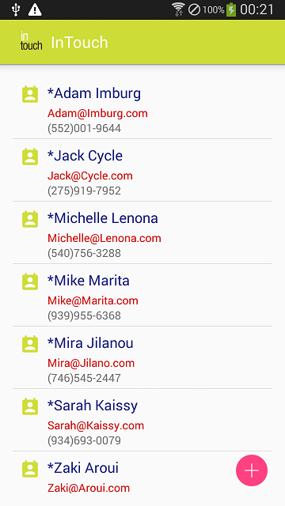
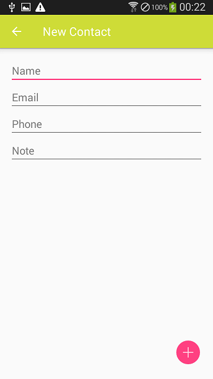
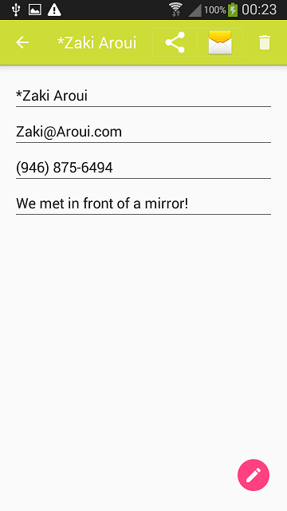
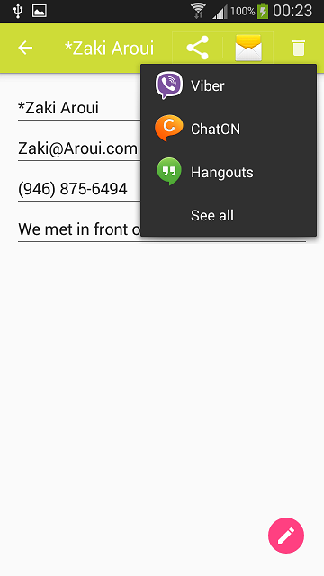

# InTouch
This repo includes the source code of the project InTouch.

InTouch is a mobile app developed in Android using Android Studio. The app has a simple approach of saving the contact information of the people you get in touch with at events or meetups, in an easy and simple way, just by saving the person's name, email, phone, and a note about how did you met (to help you memorize your people!!!)

All the contacts that you save using InTouch are stored in you phone's contacts local database with your other contacts, and can be accessed from your default contacts or dialer apps.

# Description

InTouch is a simply designed app that helps you stay in touch with the people that you meet and want them to be in you network.

__The Main Activity__

The below screenshot is the first activity (view), which is started when the app is launched. Is shows a list of contacts that you have stored in your phone. The app is designed to show only the contact that have email addresses, meaning that if you have a contact that doesn't have an email address then it won't show up on the list (**NOTE:** _**the contacts that are shown in the below screenshot are fake as well as all of their information, even mine !!**_ ). 
Additionally, the contacts' information shown in this activity includes only name, email and phone number, which makes the app simple and gives quick review of the contact.

This app makes use of Android's content providers to get the contacts list stored in your phone.

Also, the "Plus" floating button in this activity is for adding new Touch (new contact). Once pressed, it will take you the activity of creating a new Touch.

__The New Contact Activity__

This below screenshot represents the new contact activity that will start when a user presses the "Plus" floating point or chooses "Create Contact" from the drop-down menu.

Again, for the simplicity of the app, this activity has four inputs for name, email, phone number and a note. The user can add a new contact by typing the contact's information in the specified fields and then press the "Plus" floating point. 

The app uses implicit intents to store contacts to the phone, by using the phone's default contacts app.

__The phone's Default Contacts App Activity__

When the users types the contact's information in the specified fields and then press the "Plus" floating point, the app starts the phone's default contacts app with the activity responsible for creating a new contact (as shown in the screenshot below). Then the user can finish the creation of the new contact or add more information about the contact. When done creating the contact or pressing Back, the user will go back to InTouch's mainactivity.

__The Contact's Edit Activity__

The user can click on any of his contacts in the main activity to see more info about that specific contact; when the user does this, the below activity starts. This activity provides some functions to be done on the contact's information, like: sharing, editing or deleting.

The share button in the action bar allows the user to share some information about the contact with other contacts, using any of the apps that have the share action, which the user has installed in the phone, like the Messaging app.

The delete button in the action bar allows the user the delete the selected contact and all its information definitely  from the phone !!

The floating point in the bottom right side of the screen allows the user to edit the selected contact. If pressed, the user will be able to continue editing the contact using the phone's default contacts app. Once done or by pressing Back, the user will go back to InTouch's mainactivity.

__The Share Button__

When the user presses the share button, a menu of all the available apps that can share the contacts information are provided, which will allow the user to choose the convenient app. An example of the available sharing apps is shown in the below screenshot.

# Try InTouch

You can try InTouch in two different ways. One, by downloading the source code, and then build the app using Android Studio (which is the IDE used to develop InTouch). Two, by downloading the apk file included in this repo under the name of __InTouch_debug.apk__ (this is a debug apk) and then install it in your phone.

# Needed Permissions

As InTouch focuses on user contacts, it needs permission to access user contacts stored locally in the phone.

# Future implementations

This is the first version of InTouch, which is pretty much basic (Actually that's what the app is intended for. Simplicity!!); However, few more features can make the app more enjoyable. First, the integration of a search bar to allow the user to search for specific contacts in the contact list; for this purpose, this [link][1] is really useful to use Android Search Dialog with some of its cool features.

Second, the use of the text recognition API, in order to allow the user to scan business cards and retrieve  the contact's information from them; to achieve this, the [Google's text recognition api][2] would be used.

## Further resources

[Android's search dialog setup][1]

[Google's text recognition api][2]

[1]: https://developer.android.com/guide/topics/search/search-dialog.html "Title"
[2]: https://developers.google.com/vision/text-overview "Title"
